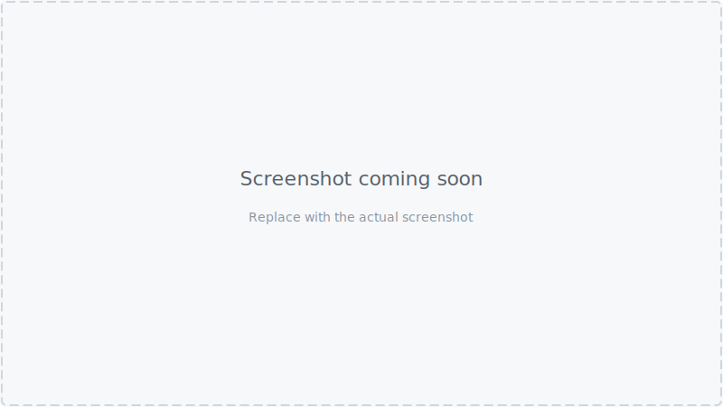

# Running Postman Flows in CI Without Paying for Enterprise — Our Workaround

We hit a wall. We had a perfectly organised Postman collection, a clean CI pipeline,
and a desire to run multi-step API flows automatically on every pull request. The only
thing standing between us and that goal was a paywall.

Here's how we got around it — without duplicating a single request.

---

## The Problem: We Wanted Flows, Not Just Folders

Our backend exposes a JSON REST API. We use Postman to document and test every endpoint.
After a while, individual endpoint tests started feeling hollow — they told us each
request worked, not whether the API held together as a system.

What we really needed to validate was _sequences_. The kind of journey a real client
goes through:

- Admin logs in
- Creates an organisation
- Edits it
- Views it to confirm the change persisted

Or a more complex one involving two users — an admin who creates an organisation and
sends an invitation, and a member who logs in separately and accepts it. Each step
depends on the one before. The invitation ID from step four has to reach step five; the
access token from step one has to reach every authenticated request after it.

These aren't just endpoint tests. They're _user journeys_ expressed as API calls.

Postman has a feature built for exactly this: **Flows**. It's a visual canvas, distinct
from the Collections view, where you drag saved requests onto a board, connect them
with arrows, and define the sequence without writing orchestration code. Variables pipe
automatically between steps.


_The Postman Flows canvas showing the Organisation creation flow. Request nodes are connected by arrows; variable bindings are visible between steps._

We started building flows there. They were clear, maintainable, and made it immediately
obvious how the API was meant to be used.

Then we tried to run them in CI.

---

## The Limitation: Postman Flows Require Enterprise to Run from CLI

Postman has a separate CLI tool (distinct from [Newman][newman], Postman's open-source
collection runner) that includes a `postman flows run` command. We got excited. We
[read the docs][flows-docs]. Then we hit this:

> `postman flows run` requires a Postman Enterprise plan.


_The Postman documentation showing that `postman flows run` requires an Enterprise plan._

We're a small team. Enterprise pricing for a test runner felt like a lot.

The [community thread on running Flows in CI/CD][thread] had been open since 2023 with
no free solution. The [GitHub issue][gh-issue] requesting Newman support for Flows had
plenty of 👍 reactions and no resolution.

The fallback recommendation was the same everywhere: _convert your Flows to a
Collection and use [Newman][newman]_.

Which brings us to the real problem.

---

## Why "Just Use a Folder" Doesn't Work

[Newman][newman] is Postman's open-source CLI runner. It takes a collection JSON file
and an optional environment file, fires every request in sequence, and reports the
results. Free, no account required.

Newman can organise requests into folders and run a specific folder with `--folder`.
The obvious approach: create a folder per flow, put the requests in order, and run each
folder. Sounds right, right?

There are two problems.

**First, there's no sequencing across folders.** If your flow needs requests from
different folders — a login from `Authentication/`, a create from `Groups/` — you
can't compose them without copying them. There's no concept of "run this request from
over there, then this one from here."

**Second, that duplication compounds fast.** Our collection had duplicate "Invite User"
requests — one under `Organisation`, one under `Groups`. Every time the endpoint
changed, we'd have to update multiple places.


_Both copies of "Invite User" visible side by side under different parent folders — the duplication problem in plain sight._

Postman Flows solve this elegantly on the canvas — you drag the same request block
into multiple flows without duplicating anything. In a Collection, there's no concept
of a reference or alias.

---

## What We Tried First: `setNextRequest()`

Newman supports `pm.execution.setNextRequest()`. Call it from a test script and Newman
will jump to a different request instead of continuing sequentially.

The idea: keep all requests in a `Requests/` folder (defined once), add a `Flows/`
folder with lightweight entry-point requests, and have each entry point set up a
sequence of step names. A collection-level test script acts as a router:

```javascript
// Collection-level test script — the "flow router"
const stepsJson = pm.globals.get('_flow_steps');
if (!stepsJson) return;

const steps = JSON.parse(stepsJson);
const idx = steps.indexOf(pm.info.requestName);

if (idx === -1) return;

const nextIdx = idx + 1;
if (nextIdx < steps.length) {
  pm.execution.setNextRequest(steps[nextIdx]);
} else {
  pm.globals.unset('_flow_steps');
  pm.execution.setNextRequest(null);
}
```

We got excited. We ran it. This appeared in the terminal:

```
Attempting to set next request to Organisation admin login
```

And then Newman stopped. One request executed.

The issue: when you pass `--folder "Organisation creation"` to Newman, it only _loads_
the requests in that folder. `Organisation admin login` lived in `Requests/User/` — a
completely separate folder Newman hadn't loaded. From its perspective, that request
didn't exist.

`setNextRequest()` works across folders when you run the _entire_ collection without
`--folder`, but then you have no way to run just one flow. The state management quickly
becomes unmanageable.

---

## The Solution: Generate a Temporary Collection

We stepped back and asked a simpler question: _what does Newman actually need?_

Newman needs a collection file. It doesn't care where that file came from. So instead
of trying to make the collection flow-aware at runtime, we generate a **temporary, flat
collection** containing exactly the requests for a given flow — pulled from the main
collection — and run Newman against that.

Requests are still defined exactly once. The flow definition is a tiny JSON file
listing step names in order. A Node.js script does the assembly.

### The flow definitions

```json
// dev/Postman/flows/org-creation.json
{
  "name": "Organisation creation",
  "description": "Admin logs in, creates an organisation, edits it, and views it.",
  "steps": [
    "Organisation admin login",
    "Create Organisation",
    "Edit Organisation",
    "View Organisation"
  ]
}
```

```json
// dev/Postman/flows/member-invitation.json
{
  "name": "Member invitation",
  "description": "Admin creates an org, member logs in, admin invites them, member accepts.",
  "steps": [
    "Organisation admin login",
    "Create Organisation",
    "Organisation member login",
    "Invite member",
    "Accept invitation"
  ]
}
```

### The runner script

`run-flow.js` takes two inputs that already exist in any Postman project:

- **The collection JSON** — exported from Postman desktop (`File → Export → Collection v2.1`). This contains every request definition, test script, and variable.
- **The environment JSON** — also exported from Postman. It holds the base URL, credentials, and any environment-specific values.

The script reads both, looks up the named requests, assembles a temporary collection,
and hands it to Newman:

```javascript
// dev/Postman/run-flow.js (abridged)
function findRequest(items, name) {
  for (const item of items) {
    if (item.item) {
      const found = findRequest(item.item, name);
      if (found) return found;
    } else if (item.name === name) {
      return item;
    }
  }
  return null;
}

const flowItems = flowDef.steps.map(stepName => {
  const req = findRequest(collection.item, stepName);
  if (!req) { console.error(`Step "${stepName}" not found`); process.exit(1); }
  return req;
});

const tempCollection = {
  info: { ...collection.info, name: `Flow: ${flowDef.name}` },
  item: flowItems,
};

newman.run({ collection: tempCollection, environment: envFile, ... });
```

### The repository layout

```
project-root/
├── mock-server.js                               ← demo mock API (npm run mock)
├── test.js                                      ← starts mock, runs all flows, stops mock (npm test)
└── dev/
    └── Postman/
        ├── collection/
        │   └── my-api.postman_collection.json   ← exported from Postman
        ├── environments/
        │   ├── environment.mock.postman_environment.json   ← used by npm test (demo)
        │   ├── environment.local.postman_environment.json  ← your local API
        │   └── environment.ci.postman_environment.json     ← CI / staging
        ├── flows/
        │   ├── org-creation.json
        │   └── member-invitation.json
        └── run-flow.js
```

### Sample output

```
[test] Starting mock server on port 3000...
[test] Server is ready.

▶ Running flow: Member invitation
  Steps: Organisation admin login → Create Organisation → Organisation member login → Invite member → Accept invitation

→ Organisation admin login
  POST http://localhost:3000/api/auth/login [200 OK, 366B, 23ms]
  ✓  Status code is 200
  ✓  Response has access_token

→ Create Organisation
  POST http://localhost:3000/api/organisations [201 Created, 368B, 3ms]
  ✓  Status code is 201
  ✓  Response has organisation id

  ... (remaining steps) ...

┌─────────────────────────┬──────────┬────────┐
│                         │ executed │ failed │
├─────────────────────────┼──────────┼────────┤
│              requests   │        5 │      0 │
│              assertions │        9 │      0 │
└─────────────────────────┴──────────┴────────┘

✅ Flow "Member invitation" passed.
✅ Flow "Organisation creation" passed.

[test] Stopping mock server...
```

---

## Running the Flows

### Demo — against the mock server

`npm test` is self-contained. It starts the mock server, runs every flow against it,
and stops it afterwards. No real API, no credentials, no network required.

```bash
npm install
npm test
```

To run a single flow against the mock server:

```bash
# Terminal 1 — start the mock server
npm run mock

# Terminal 2 — run one flow
ENV=mock node dev/Postman/run-flow.js "Organisation creation"
ENV=mock node dev/Postman/run-flow.js "Member invitation"
```

### Pointing at your real API

When adapting this for your own project, replace the mock with your real backend. Export
your Postman collection and environment files into the same folder structure, then run:

```bash
# Against a local dev server (uses environment.local.postman_environment.json)
node dev/Postman/run-flow.js "Organisation creation"

# Against a staging or CI server (uses environment.ci.postman_environment.json)
ENV=ci node dev/Postman/run-flow.js "Organisation creation"
```

The environment files contain the `base_url` and credentials for each target. For CI,
set `ADMIN_USERNAME`, `ADMIN_PASSWORD`, `MEMBER_USERNAME`, and `MEMBER_PASSWORD` as
environment variables (or GitHub Actions secrets).

---

## CI Integration

In GitHub Actions, the flows run automatically on every push and pull request:

```yaml
- name: Run Newman — all flows
  run: npm test

- name: Store Newman artifacts
  if: always()
  uses: actions/upload-artifact@v4
  with:
    name: newman-results
    path: tests/results/newman
    retention-days: 7
```

Adding a new flow requires no changes to `run-flow.js` or the CI workflow. Drop a new
`.json` file into `dev/Postman/flows/` and it's automatically picked up on the next run.


_A passing GitHub Actions run: the Newman step shows green and the `newman-results` artifact is listed in the Summary tab._

---

## What We Gained

- **No duplication.** Every request is defined exactly once. Flows are just ordered lists of names.
- **Free plan only.** No Enterprise subscription, no cloud execution, no Newman patches.
- **Postman Flows canvas still works for design.** We kept using it to diagram and document — just not to run.
- **CI-friendly.** JUnit XML and HTML reports are generated per flow and uploaded as artifacts.
- **Self-discoverable.** Drop a new `.json` into `dev/Postman/flows/` and `npm test` picks it up — no other changes needed.

---

## TODO

**Migrate flow definitions into the collection (preferred approach)**

This repo stores flow definitions as separate JSON files (`dev/Postman/flows/*.json`). A
better approach — implemented in production in `legal_connection_headless_drupal` — is to
keep flow definitions **inside the Postman collection** under a `Flows/` folder. Each flow
is a plain request named after the flow; its pre-request script calls `steps([...])` with the
ordered step names:

```javascript
// Admin logs in, creates an organisation, edits it, and views it.
// Run this flow: ENV=mock node dev/Postman/run-flow.js "Organisation creation"
steps([
  'Organisation admin login',
  'Create Organisation',
  'Edit Organisation',
  'View Organisation',
]);
```

`run-flow.js` finds the matching request in `Flows/`, evaluates the pre-request script in a
Node.js `vm` sandbox to capture the steps array, then assembles and runs the temporary
collection as before. The flow name comes from the request name, not a separate file.

Benefits over external JSON files:

- Flow definitions travel with the collection — one export covers everything.
- Flows are visible and editable in the Postman desktop sidebar.
- No separate `flows/*.json` files to keep in sync with collection request names.
- The validator can check all flows in a single pass over the collection JSON.

See `dev/Postman/` in `legal_connection_headless_drupal` for the reference implementation.

---

**Package the TypeScript runner and consume it via `package.json`**

The runner in this repo (`dev/Postman/run-flow.js`) is plain JavaScript. A more capable
TypeScript version — with full Postman collection types, `--all` / `--env` flags, and
in-collection flow discovery — lives at `tests/apis/run-flow.ts` in
`legal_connection_headless_drupal`. The goal is to move that file into this repo, ship it as
an npm package, and have `legal_connection_headless_drupal` (and any future consumer) pull it
in via `package.json` instead of maintaining its own copy.

Steps:

1. Copy `tests/apis/run-flow.ts` from `legal_connection_headless_drupal` into this repo (e.g. `src/run-flow.ts`).
2. Add a `package.json` `"bin"` entry so the runner is callable as `run-flow` after install.
3. Compile to JS on publish (`tsc`) or ship source with `tsx` as the runtime via `bin`.
4. In `legal_connection_headless_drupal`, replace the local copy with a `devDependency` on this
   package and update `package.json` scripts to call the installed binary instead.
5. Remove `tests/apis/run-flow.ts` from `legal_connection_headless_drupal` once the dependency
   is wired up and all flows pass.

The in-collection flow format (described in the TODO above) should be the baseline before
packaging, since the runner and the flow storage format need to match.

---

**Repository: `newman-flows`**

The package and repository are published as `newman-flows` at
`https://github.com/marcelovani/newman-flows`, following the `newman-*` ecosystem
convention used by reporters.

---

**Separate the article from the technical README**

The current `README.md` is a narrative Medium-style article explaining _why_ this approach
exists. That is valuable for readers arriving from a blog post, but it is the wrong document
for a developer who just cloned the repo and wants to know how to run the flows.

Steps:

1. Move the current `README.md` to `docs/medium.md` (preserving the full article text).
2. Replace `README.md` with a short, technical document covering only:
   - What the repo is (one sentence)
   - Prerequisites (`node`, `newman`)
   - Installation (`npm install`)
   - Running a single flow and running all flows
   - Adding a new flow (brief steps)
   - CI integration snippet
   - Link to `docs/medium.md` for the full background article

The article in `docs/medium.md` can link back to the repo as it already does, and the new
`README.md` can open with a one-line pointer: _"For the full background on why this exists,
see [docs/medium.md](docs/medium.md)."_

---

## Limitations

This approach is a workaround, not a first-class solution.

**`pm.execution.runRequest()` is the right answer — when it works.**
Postman shipped this API in 2025 and it does exactly what we wanted: invoke any saved
request from a script without duplication. It doesn't work in Newman yet. If and when
Newman gains support, `run-flow.js` becomes unnecessary.

**Step names must match exactly.** If someone renames a request in the Postman desktop
and exports the collection without updating the flow JSON, the runner exits with a
helpful error. It's a light coupling, but it's there.

**Parallel branches aren't supported.** Postman Flows can run request blocks in
parallel on the visual canvas. Our sequential runner can't. Every flow is a straight
line — which covers the vast majority of API test scenarios.

---

## The Takeaway

To be blunt: this workaround is not as good as Postman Flows.

Flows give you a visual canvas where sequences are immediately legible — you can see
what connects to what, where variables flow between steps, and how branches fork. Our
JSON files and a Node.js script are a pale imitation of that.

If your team is already on Enterprise, use `postman flows run` — it's the right tool.

But if you're on the free plan and need multi-step API flows in CI without duplicating
request definitions, the underlying problem is solvable with the tools you already
have. A small Node.js script and a handful of JSON files gets you most of the way there.

If Postman ever ships Newman support for Flows on the free plan, delete `run-flow.js`
and don't look back.

The full implementation referenced in this post is at
[github.com/marcelovani/postman-flows](https://github.com/marcelovani/postman-flows).

---

## Try It Now

The repo ships with a built-in mock server so you can run every flow immediately,
without a real API or a Postman account.

> **About the demo:** The mock server (`mock-server.js`) is a lightweight Express app
> that simulates every API endpoint used in the collection. It runs locally on port 3000
> and accepts any credentials. This lets you explore the approach without connecting to
> a real backend. When you adapt this for your own project, you point the flows at your
> real API instead — see [Pointing at your real API](#pointing-at-your-real-api) above.

```bash
git clone https://github.com/marcelovani/postman-flows.git
cd postman-flows
npm install
npm test
```

`npm test` starts the mock server, runs every flow, and shuts it down. You should see:

```
✅ Flow "Member invitation" passed.
✅ Flow "Organisation creation" passed.
```

---

[newman]: https://github.com/postmanlabs/newman
[thread]: https://community.postman.com/t/use-postman-flows-in-ci-cd-github-actions/62677
[gh-issue]: https://github.com/postmanlabs/postman-app-support/issues/11770
[flows-docs]: https://learning.postman.com/docs/postman-flows/tutorials/video/create-first-flow
